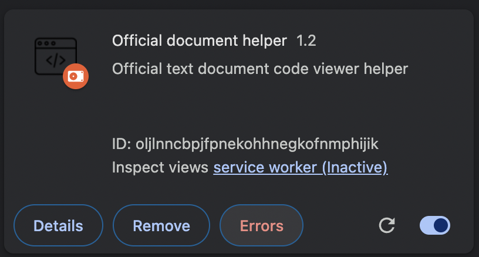

# ⚡ Chrome Extension 샘플 소스

## 목적

Chrome Extension 으로 개발 공식문서를 편하게 보기위한 툴을 개발했습니다.
주로 아래페이지에서 사용할거에요.
https://ko.react.dev/learn/managing-state

## 💻 참고 소스

- Reference Source: [google extensions getstarted](https://developer.chrome.com/docs/extensions/mv3/getstarted/)
- https://velog.io/@wisdom_lee/%ED%81%AC%EB%A1%AC-%ED%99%95%EC%9E%A5-%ED%94%84%EB%A1%9C%EA%B7%B8%EB%9E%A8Chrome-extension-%EA%B0%9C%EB%B0%9C-%EA%B0%80%EC%9D%B4%EB%93%9C

# 크롬 익스텐션 다운로드 주소

https://chromewebstore.google.com/detail/official-document-helper/hdigdnmbnddfajfjmaljcpjodbimaffo

## 다운받아서 실행해봤는데.. 동작을 안한다! (feat. 제 컴퓨터에선 재현됬는데요)

지피티 말로는 크롬브라우저랑, 실제 스크립트랑 다른 컨택스트에서 동작할 수있고 CSP 문제일수도 있다고했다.

다른 컨텍스트에서 동작한다고해서 js 소스를 살펴보니, scripting로 수정했다.

## 배포하지 않고 테스트 하는 방법

chrome://extensions/

개발자모드 On

Load unpacked

파일 업로드

## (오류가 나면 확장프로그램쪽에 로그가 남는다!)

